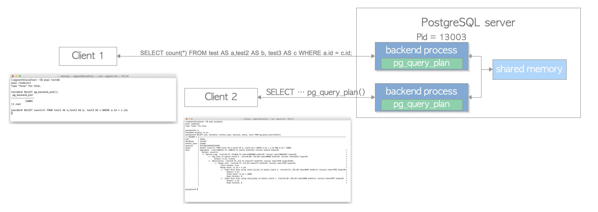

pg_query_plan
=============

`pg_query_plan` is a module that monitors the query plan of the running query.
Similar to auto_explain, it stores the executed plan into the query_plan.log table in the `postgres` database.


https://user-images.githubusercontent.com/7246769/126768894-a5bca8e6-8b5a-4bc0-b1c5-4c507dd0932b.mp4


## Contents

1. [Installation and Setting](#1-installation-and-setting)  
2. [How to Use](#2-how-to-use)  
3. [Architecture](#3-architecture)  
4. [Configuration Parameters](#4-configuration-parameters)  
5. [Function Definition](#5-function-definition)  
6. [Table Definition](#6-table-definition)  
7. [Limitations and Warning](#7-limitations-and-warning)


## 1. Installation and Setting


pg_query_plan currently supports PostgreSQL 13,14 and 15, and it can be installed by running the usual installing process shown below.

```
$ cd postgresql/contrib
$ git clone https://github.com/s-hironobu/pg_plan_inspector.git
$ cd pg_plan_inspector
$ make
$ make install
```

Before starting PostgreSQL server, shared_preload_libraries must be set to 'pg_query_plan' in the postgresql.conf.

```
shared_preload_libraries = 'pg_query_plan'
```

### 1.1. Notice

The pg_query_plan() function can only run on the `postgres` database by default.
If you need to execute the function on other databases, you will have to issue the following script for creating the function.

##### version 13

```
$ psql -f share/contrib/pg_query_plan--1.0.sql DATABASE_YOU_WANT_TO_USE
```

##### version 14, 15

```
$ psql -f share/postgresql/contrib/pg_query_plan--1.0.sql DATABASE_YOU_WANT_TO_USE
```


## 2. How to Use


Here, I show how to use the module using a specific example.


Assume that two clients connect to the PostgreSQL server.
Clients 1 and 2 connect to `testdb` and `postgres`, respectively.
The pid of the backend connected to Client 1 is 13003.

Assume that Client 2 has superuser privileges.


```
$ ./psql testdb
psql (14beta2)
Type "help" for help.

testdb=# SELECT pg_backend_pid();
 pg_backend_pid
----------------
          13003
(1 row)
```




Create three tables on `testdb` for the following explanation:

```
CREATE TABLE test1 (id int, data int);
CREATE INDEX test1_id_idx ON test1 (id);
CREATE TABLE test2 (id int PRIMARY KEY, data int);
CREATE TABLE test3 (id int PRIMARY KEY, data int);
INSERT INTO test1 (id, data) SELECT i, i % 51  FROM generate_series(1, 150000) AS i;
INSERT INTO test1 (id, data) SELECT i, i % 51 FROM generate_series(1, 5000) AS i;
INSERT INTO test2 (id, data) SELECT i, floor(random() * 50 + 1)::int FROM generate_series(1, 50000) AS i;
INSERT INTO test3 (id, data) SELECT i, i FROM generate_series(1, 5000) AS i;
ANALYZE;
```


Client 1 sends the following query to the backend, whose pid is 13003, and the query is being processed by backend.


```
testdb=# SELECT count(*) FROM test1 AS a,test2 AS b, test3 AS c WHERE a.id = c.id;
```

At this time, if Client 2 executes the function pg_query_plan() as follows, the query plan of the query requested by Client 1 will be displayed.


```
postgres=# \x
Expanded display is on.
postgres=# SELECT pid, database, worker_type, queryid, query, plan FROM pg_query_plan(13003);
-[ RECORD 1 ]----------------------------------------------------------------------------------------------------------------------------------------------------------------
pid         | 13003
database    | testdb
worker_type | leader
queryid     | 8341890905957816023
query       | SELECT count(*) FROM test1 AS a,test2 AS b, test3 AS c WHERE a.id = c.id;
plan        | Finalize Aggregate  (cost=2963085.37..2963085.38 rows=1 width=8) (actual rows=0 loops=0)                                                                       +
            |   Output: count(*)                                                                                                                                             +
            |   ->  Gather  (cost=2963085.16..2963085.37 rows=2 width=8) (actual rows=0 loops=0)                                                                             +
            |         Output: (PARTIAL count(*))                                                                                                                             +
            |         Workers Planned: 2                                                                                                                                     +
            |         Workers Launched: 2                                                                                                                                    +
            |         ->  Partial Aggregate  (cost=2962085.16..2962085.17 rows=1 width=8) (actual rows=0 loops=0)                                                            +
            |               Output: PARTIAL count(*)                                                                                                                         +
            |               ->  Nested Loop  (cost=0.79..2687350.89 rows=109893707 width=0) (actual rows=60269355 loops=0)                                                   +
            |                     ->  Merge Join  (cost=0.79..381.99 rows=2205 width=0) (actual rows=1206 loops=0)                                                           +
            |                           Inner Unique: true                                                                                                                   +
            |                           Merge Cond: (a.id = c.id)                                                                                                            +
            |                           ->  Parallel Index Only Scan using test1_id_idx on public.test1 a  (cost=0.42..3120.92 rows=64568 width=4) (actual rows=1206 loops=0)+
            |                                 Output: a.id                                                                                                                   +
            |                                 Heap Fetches: 0                                                                                                                +
            |                           ->  Index Only Scan using test3_pkey on public.test3 c  (cost=0.28..139.28 rows=5000 width=4) (actual rows=1821 loops=0)             +
            |                                 Output: c.id                                                                                                                   +
            |                                 Heap Fetches: 0                                                                                                                +
            |                     ->  Seq Scan on public.test2 b  (cost=0.00..720.29 rows=49829 width=0) (actual rows=50000 loops=1205)                                      +
            |                           Output: b.id, b.data                                                                                                                 +
            | 
-[ RECORD 2 ]----------------------------------------------------------------------------------------------------------------------------------------------------------------
pid         | 13022
database    | 
worker_type | parallel worker
queryid     | 8341890905957816023
query       | SELECT count(*) FROM test1 AS a,test2 AS b, test3 AS c WHERE a.id = c.id;
plan        | Partial Aggregate  (cost=2962085.16..2962085.17 rows=1 width=8) (actual rows=0 loops=0)                                                                        +
            |   Output: PARTIAL count(*)                                                                                                                                     +
            |   ->  Nested Loop  (cost=0.79..2687350.89 rows=109893707 width=0) (actual rows=61002377 loops=0)                                                               +
            |         ->  Merge Join  (cost=0.79..381.99 rows=2205 width=0) (actual rows=1221 loops=0)

... snip ...

```


If the duration time of the query exceeds the value of pg_query_plan.log_min_duration,
the executed plan and related information will be stored in the query_plan.log table.

```
postgres=# SELECT seqid, database, pid, queryid, query, plan FROM query_plan.log WHERE queryid = '8341890905957816023' AND pid = 13003;
-[ RECORD 1 ]-------------------------------------------------------------------------------------------------------------------------------------------------------------
seqid    | 383
database | testdb
pid      | 13003
queryid  | 8341890905957816023
query    | SELECT count(*) FROM test1 AS a,test2 AS b, test3 AS c WHERE a.id = c.id;
plan     | Finalize Aggregate  (cost=2963085.37..2963085.38 rows=1 width=8) (actual rows=1 loops=0)                                                                       +
         |   Output: count(*)                                                                                                                                             +
         |   ->  Gather  (cost=2963085.16..2963085.37 rows=2 width=8) (actual rows=3 loops=0)                                                                             +
         |         Output: (PARTIAL count(*))                                                                                                                             +
         |         Workers Planned: 2                                                                                                                                     +
         |         Workers Launched: 2                                                                                                                                    +
         |         ->  Partial Aggregate  (cost=2962085.16..2962085.17 rows=1 width=8) (actual rows=1 loops=2)                                                            +
         |               Output: PARTIAL count(*)                                                                                                                         +
         |               Worker 0:  actual rows=1 loops=1                                                                                                                 +
         |               Worker 1:  actual rows=1 loops=1                                                                                                                 +
         |               ->  Nested Loop  (cost=0.79..2687350.89 rows=109893707 width=0) (actual rows=168800000 loops=2)                                                  +
         |                     Worker 0:  actual rows=162400000 loops=1                                                                                                   +
         |                     Worker 1:  actual rows=175200000 loops=1                                                                                                   +
         |                     ->  Merge Join  (cost=0.79..381.99 rows=2205 width=0) (actual rows=3376 loops=2)                                                           +
         |                           Inner Unique: true                                                                                                                   +
         |                           Merge Cond: (a.id = c.id)                                                                                                            +
         |                           Worker 0:  actual rows=3248 loops=1                                                                                                  +
         |                           Worker 1:  actual rows=3504 loops=1                                                                                                  +
         |                           ->  Parallel Index Only Scan using test1_id_idx on public.test1 a  (cost=0.42..3120.92 rows=64568 width=4) (actual rows=3377 loops=2)+
         |                                 Output: a.id                                                                                                                   +
         |                                 Heap Fetches: 0                                                                                                                +
         |                                 Worker 0:  actual rows=3249 loops=1                                                                                            +
         |                                 Worker 1:  actual rows=3505 loops=1                                                                                            +
         |                           ->  Index Only Scan using test3_pkey on public.test3 c  (cost=0.28..139.28 rows=5000 width=4) (actual rows=5000 loops=2)             +
         |                                 Output: c.id                                                                                                                   +
         |                                 Heap Fetches: 0                                                                                                                +
         |                                 Worker 0:  actual rows=5000 loops=1                                                                                            +
         |                                 Worker 1:  actual rows=5000 loops=1                                                                                            +
         |                     ->  Seq Scan on public.test2 b  (cost=0.00..720.29 rows=49829 width=0) (actual rows=50000 loops=9999)                                      +
         |                           Output: b.id, b.data                                                                                                                 +
         |                           Worker 0:  actual rows=50000 loops=3248                                                                                              +
         |                           Worker 1:  actual rows=50000 loops=3504                                                                                              +
         |

postgres=#
```


## 3. Architecture


The architecture of this module is shown below.


Every backend process has this module.
A background worker process runs to store the executed plans.


### 3.1. How to show the query plans

When Client 2 executes the pg_query_plan() function in order to show the query plan of the query issued by Client 1,
the function invokes a kill system call to send a SIGUSR2 signal to the backend of Client 1.
After that, the backend that sent the signal enters into sleep mode.


The backend received the SIGUSR2 signal is interrupted by the current processing and invokes the signal handler function.
The signal handler function gathers the current states of the running query including the query plan, and stores them in the shared memory.
After that, the backend invokes the latch to wake up the backend of Client 2, which is currently in sleep mode.


After waking up from receiving the latch, the backend of Client 2 gets the query plan on the shared memory and displays it.


##### Note:
This is the [strace log](./strace.log) of the backend that runs the signal handler function invoked by SIGUSR2 during executing the handler function.


### 3.2. How to store the executed plans into the query_plan.log table

After executing the query, if the duration time of the query exceeds the value of pg_query_plan.log_min_duration, the executed plan and the related information are stored in the ring buffer, which is allocated on the shared dynamic memory of the background worker.


The background worker periodically sweeps the ring buffer and inserts the information stored in it into the query_plan.log table.


##### Note:
Although the background worker runs even if PostgreSQL server is in standby mode, it does nothing practically.
This is because PostgreSQL in standby mode cannot write to tables anything.

I am thinking to add a feature that the background worker writes the log data to the message broker systems such as Kafka.
However, the specifics such as the schedule have not been decided yet.


## 4. Configuration Parameters


+ `pg_query_plan.global_show_plan`:  
In the entire server, show the executing query and query plan. (The default is true.)
+ `pg_query_plan.show_plan`:  
Show the executing query and query plan. show_plan is force set to false if global_show_plan is false. (The default is true.)
+ `pg_query_plan.global_store_plan`:  
In the entire server, store the executed query and executed plan into the query_plan.log table. global_store_plan is disabled, i.e. practically false, if either global_show_plan or show_plan is false. (The default is true.)
+ `pg_query_plan.store_plan`:  
Store the executed query and query plan into the query_plan.log table. store_plan is forced set to false if either global_store_plan, global_show_plan or show_plan is false. (The default is true.)
+ `pg_query_plan.log_min_duration`:  
Sets the minimum execution time in seconds above which plans will be logged. (The default is 10 [sec].)


## 5. Function Definition


+ Function Name: public.pg_query_plan
+ Input: pid integer
+ Output: set of record

Column | Type | Description
--- | --- | ---
pid | integer | Pid of the backend that runs this query
database | text | Database name
worker_type | text | "leader" or "parallel worker"
nested_level | integer | Nested Level of this query
queryid | text | Query id of this query
query_start | timestamp with tz | Timestamp when this query starts
query | text | Query
planid | text | Plan id of this query plan
plan | text | Query plan with text format
plan_json | text | Query plan with json format


*Note*: Although queryid and planid are internally treated as uint64, their values are stored into the text columns because Postgres only supports int64 (bigint).


## 6. Table Definition


+ Table: query_plan.log


Column | Type | Description
--- | --- | ---
seqid | bigint | Sequential number of this log
starttime | timestamp with time zone | Timestamp when this query starts
endtime | timestamp with time zone | Timestamp when this query ends
database | text | Database name
pid | integer | Pid of the backend that runs this query
nested_level | integer | Nested Level of this query
queryid | text | Query id of this query
query | text | Query
planid | text | Plan id of this query plan
plan | text | Executed plan with text format
plan_json | text | Executed plan with json format


*Note*: Although queryid and planid are internally treated as uint64, their values are stored into the text columns because Postgres only supports int64 (bigint).

## 7. Limitations and Warning

### 7.1. Limitations

1. This module is currently not available on standby.

### 7.2. Warning

Use this module at your own risk.

+ With this module, the performance of query processing is reduced by a few percent due to the overhead of data collection.
+ this  module uses SIGUSR2 to interrupt the target Postgres process.
