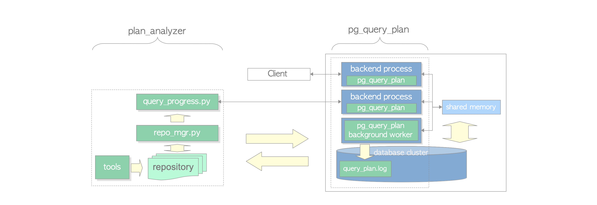

plan_analyzer
===============

`plan_analyzer` is a set of programs that analyze the executed plans stored in the query_plan.log table,
and it is currently composed of three python scripts: query_progress.py, repo_mgr.py and analyze.py.





+ `query_progress.py` shows the result of the pg_query_plan() function and estimates the progress of query execution using the result.
+ `repo_mgr.py` is a tool to manage the repository that stores the executed plans, which are stored in the query_plan.log table on the PostgreSQL server.
+ `analyze.py` placed in the `tools` directory analyzes the stored executed plans in a specified repository. Refer to [README-tools.md](./README-tools.md) in detail.

## Contents

1. [Requirement](#1-requirement)  
2. [Tutorial](#2-tutorial)  
3. [Usage](#3-Usage)  
4. [Repository](#4-Repository)  
5. [Limitations and Warning](#5-limitations-and-warning)


## 1. Requirement


### Python

+ [python3.6 or later](https://www.python.org/)
+ psycopg2
+ numpy
+ sklearn


## 2. Tutorial


I explain how to use this module using the tutorial format.

### 2.1. Installation

If you have not installed python yet, install python3.6 or later in your environment.


Then, install the following packages using the pip command.

```
$ pip3 install psycopg2 numpy sklearn

or

$ pip3 install --user psycopg2 numpy sklearn
```

##### Info: [psycopg2 Document: Installation](https://www.psycopg.org/docs/install.html)


### 2.2. Setting PostgreSQL


If you have not set the pg_query_plan module in your PostgreSQL server yet, set it up.
Refer to [README-pg_query_plan.md](./README-pg_query_plan.md) in detail.


In this tutorial, we assume that the hostname is `10.0.2.15` and no-password.
In addition, we set the parameter pg_query_plan.log_min_duration to 3 in the postgresql.conf.


```
pg_query_plan.log_min_duration = 3
```


### 2.3. Creating Test Tables

Create `testdb` database.

```
$ createdb testdb
```

Then, create three tables and insert data into the tables.

```
$ psql testdb
psql (14beta2)
Type "help" for help.

testdb=# CREATE TABLE test1 (id int, data int);
CREATE TABLE
testdb=# CREATE INDEX test1_id_idx ON test1 (id);
CREATE INDEX
testdb=# CREATE TABLE test2 (id int PRIMARY KEY, data int);
CREATE TABLE
testdb=# CREATE TABLE test3 (id int PRIMARY KEY, data int);
CREATE TABLE
testdb=# INSERT INTO test1 (id, data) SELECT i, i % 51  FROM generate_series(1, 150000) AS i;
INSERT 0 150000
testdb=# INSERT INTO test1 (id, data) SELECT i, i % 51 FROM generate_series(1, 5000) AS i;
INSERT 0 5000
testdb=# INSERT INTO test2 (id, data) SELECT i, floor(random() * 50 + 1)::int FROM generate_series(1, 50000) AS i;
INSERT 0 50000
testdb=# INSERT INTO test3 (id, data) SELECT i, i FROM generate_series(1, 5000) AS i;
INSERT 0 5000
testdb=# ANALYZE;
ANALYZE
```

### 2.4. Use query_progress.py


Also watch the movie: [query_progress_tutorial-01.mp4](https://user-images.githubusercontent.com/7246769/126769064-225be309-a665-42e5-85f1-63a1f025f855.mp4)


https://user-images.githubusercontent.com/7246769/126769064-225be309-a665-42e5-85f1-63a1f025f855.mp4


Before using query_progress.py, we need the pid of the backend connected to `testdb`.

```
testdb=# SELECT pg_backend_pid();
 pg_backend_pid
----------------
          25261
(1 row)
```

According to the result shown above, the pid is `25261`.


Now, we will do the first experiment.
Create another console, and issue the query_progress.py command with the following option, so you can see the message shown below.

```
$ cd ~/postgresql/contrib/pg_plan_inspector

$ ./query_progress.py --host 10.0.2.15 --port 5432 --username postgres --pid 25261

Connected to localhost

	Enter "quit" or Contrl-C to quit this script
	Enter "help" to show usage.

Enter pid (default: 25261) or "quit":
```

We have finished all preparation to show the query progress, so let us issue the following SELECT command.

```
testdb=# SELECT count(*) FROM test1 AS a,test2 AS b, test3 AS c WHERE a.id = c.id AND a.id < 2500;
```

Immediately go to another console and hit the return key repeatedly, approximately once per second.
It will show the progress of the query,
and you can see that the query completes at the same time the progress reaches almost 100%.


In this experiment, notice that the progress screen shows "Info: Using rules".


Next, we do the second experiment by issuing the following SELECT command.

```
testdb=# SELECT count(*) FROM test1 AS a,test2 AS b, test3 AS c WHERE a.id = c.id;
```

In this second experiment, unlike the first one, you will see that the query execution continues for more than a few seconds even after the query progress exceeds 99%.

This is because the Plan Rows estimated by the optimizer are inaccurate. The Plan Rows, therefore, must be corrected to show accurate query progress.


### 2.5. Create Repository and Get data

To deal with this problem, I have developed a system of increasing accuracy with one of the methods of Machine Learning.


Also watch the movie: [query_progress_tutorial-02.mp4](https://user-images.githubusercontent.com/7246769/126769143-5a523bbb-fdc0-4217-91df-d0e0278ed980.mp4)


https://user-images.githubusercontent.com/7246769/126769143-5a523bbb-fdc0-4217-91df-d0e0278ed980.mp4


To use the system, we must create a repository to store the data in the query_plan.log table.
Let us issue the repo_mgr.py command with the following options.


```
$ ./repo_mgr.py create --basedir test_repo
```

You will be able to confirm that there is a directory `pgpi_repository` and a file `hosts.conf` under the basedir `test_repo`.

```
$ ls test_repo/
pgpi_repository
$ ls test_repo/pgpi_repository/
hosts.conf
```

Then, we edit the `hosts.conf` file. In this tutorial, we must change the host to `10.0.2.15`.

```
$ vi test_repo/pgpi_repository/hosts.conf
[server_1]
host = 10.0.2.15
port = 5432
username = postgres
input_password = false
password = XXXXX

[server_2]

```

Note that the file mode of hosts.conf must be set to 640 or more secure to maintain security.


After editing, issue the repo_mgr.py command with the following options.

```
$ ./repo_mgr.py get --basedir test_repo server_1
```


### 2.6. Use query_progress.py with Repository


Also, watch the movie: [query_progress_tutorial-03.mp4](https://user-images.githubusercontent.com/7246769/126769277-0fe9fbd7-1ab8-44db-8b2f-5e734f21f3a4.mp4)


https://user-images.githubusercontent.com/7246769/126769277-0fe9fbd7-1ab8-44db-8b2f-5e734f21f3a4.mp4


To use the data in the repository that we created, issue the query_progress.py command with the following option.

```
$ ./query_progress.py --basedir test_repo --serverid server_1 --pid 25261
```

Then, we again issue the query that has been issued in the second experiment, and show the progress of the query.

```
testdb=# SELECT count(*) FROM test1 AS a,test2 AS b, test3 AS c WHERE a.id = c.id;
```

In this experiment, you can see that query_progress.py shows the progress of the query accurately.


Notice that, in this experiment, the progress screen shows "Info: Using regression params".
It means that the query progress is calculated using the regression parameters stored in the repository, not rules.


### 2.7. Push the regression parameters to server

`Push` command, which has been introduced since version 0.2, pushes the regression parameters to the specified server. The parameters are stored in the query_plan.reg table in each database.

```
$ ./repo_mgr.py push --basedir test_repo server_1
```

When planning, the optimizer checks the query_plan.reg table and if found the regression parameter of the current processing query, the optimizer adjusts the planning rows using the parameters.


Note that, this command is for a feasibility study to intervene in the optimizer's processing,
almost all users do not need this command.


## 3. Usage


### 3.1. query_progress.py


```
  query_progress.py [--host XXX] [--port NNN] [--dbname XXX] [--username XXX] [--password] [--verbose] [--pid NNN]
  query_progress.py [--basedir XXX] [--verbose]  [--pid NNN] --serverid XXX
```

option | Type | Description (default)
--- | --- | ---
--host | text | host address ("localhost")
--port | integer | port number (5432)
--dbname | text |  database name ("postgres")
--username | text | user name ("postgres")
--password | | input password
--pid | integer | pid of the backend you want to show the query progress
--basedir | text | base directory of the repository ("." : current directory)
--serverid | text | server id
--verbose | | Show query plan


#### Verbose mode

Even if you do not set the --verbose option when query_progress.py starts, you can switch to the verbose mode on or off by entering the `v` key.

### 3.2. repo_mgr.py


```
  repo_mgr.py create [--basedir XXX]
  repo_mgr.py get    [--basedir XXX] serverid
  repo_mgr.py push   [--basedir XXX] serverid
  repo_mgr.py show   [--basedir XXX] [--verbose]
  repo_mgr.py check  [--basedir XXX]
  repo_mgr.py rename [--basedir XXX] old_serverid new_serverid
  repo_mgr.py delete [--basedir XXX] serverid
  repo_mgr.py reset  [--basedir XXX] serverid
  repo_mgr.py recalc [--basedir XXX] serverid
```

#### commands

+ create command  
Create a repository.
+ get command  
Get the rows from the query_plan.log table of the specified server.
+ push command  
Push the regression parameters to the specified server.
+ check command  
Check the security of the repository and the validation of the server-ids in the hosts.conf.
+ rename command  
Rename old_serverid to new_serverid.
+ delete command  
Delete the data of the specified server in the repository.
+ show command  
Show server info in the hosts.conf.
+ reset command  
Delete only the grouping and regression data of the specified server in the repository.
+ recalc command  
Recalculate the grouping and regression data of the specified server in the repository.

##### Options
+ basedir
  - base directory of the repository ("." : current directory)


## 4. Repository


### 4.1. hosts.conf Format

The format of the hosts.conf file conforms to the [INI](https://en.wikipedia.org/wiki/INI_file).

A specific example is shown below. This example contains three server-Ids.

```
[server_1]
host = 192.168.80.10
port = 5432
username = postgres
input_password = false
password =


[server_2]
host = 192.168.80.20
port = 5432
username = postgres
input_password = true


[server_3]
host = 192.168.80.30
port = 5432
username = postgres
password = Passw0rd

```

#### server-id

Each section has a server-Id.

A server-Id is a string and must match the following regular expression:

```
[0-9A-z][0-9A-z_]*
```

##### Examples

- Valid server-id names
```
server_1
server02
db_3
```

- Invalid server-id names
```
_server1
server-2
db:3
```


### 4.2. Setting password

When connecting to a database, there are two ways to set the user's password:

(1) Set 'input_password' to 'true' in the hosts.conf file. In this case, prompt to enter the password whenever connecting to the database.

(2) Write passwords to the 'password' key in the hosts.conf file.


## 5. Limitations and Warning

### 5.1. Limitations

1. This module cannot work if the query handles the partitioned tables.
2. This module cannot work if the query has custom scans or foreign scans.
3. This module does not consider the effects of triggers.

### 5.2. Warning

+ This module is not stable.
+ The values provided by this module are estimates, not guaranteed to be 100% accurate.
