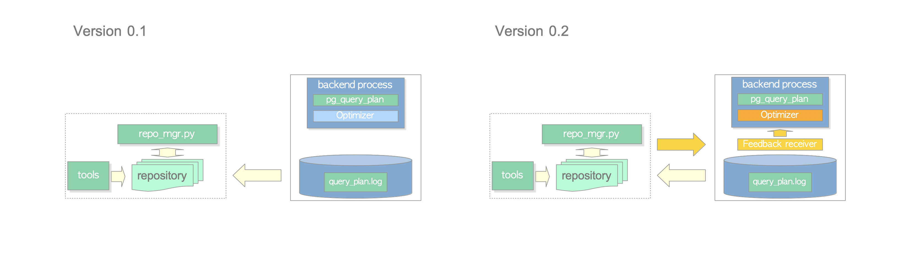
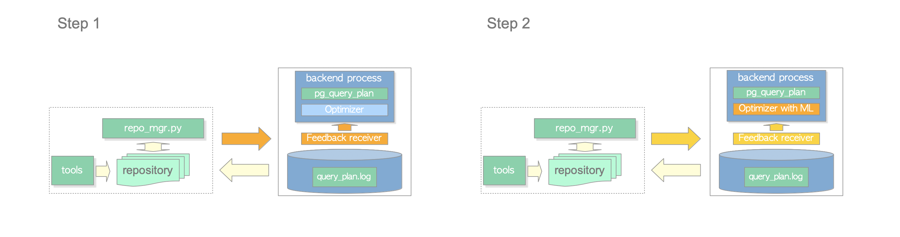

pg_plan_inspector
=================

`pg_plan_inspector` is being developed as a framework to monitor and improve the performance of PostgreSQL using Machine Learning methods.

One movie is worth a thousand words.
I demonstrate that a tool provided by this framework shows the progress of a running query.
Watch this: [query-progress-example01.mp4](https://user-images.githubusercontent.com/7246769/126768623-d02a3bea-edb1-4776-adaf-ce871ce526e5.mp4)

https://user-images.githubusercontent.com/7246769/126768623-d02a3bea-edb1-4776-adaf-ce871ce526e5.mp4

This is a POC model, and the primary purposes of this framework are:

1. To implement an external module that monitors the state of the running queries. (Refer to [[6](#references)].)
2. To show that the PostgreSQL optimizer can be improved from providing feedback on the analysis of the executed plans.
3. To study the possibilities of the concept of Self-Driving DBMS. (Refer to [[2,3](#references)].)

To achieve these purposes, I am currently developing two modules: `pg_query_plan` and `plan_analyzer`.

The development of this framework has just begun.
The movie shown above is the result of one of the by-products of developing these modules.

#### Terminology

+ Executed plan  
An executed plan is a plan that contains both estimated and actual values, i.e. it is the same as the result of the EXPLAIN command with ANALYZE option.
+ Query plan  
A query plan is a snapshot of the executed plan, which is taken by the pg_query_plan module. It also contains both estimated and actual values, and the actual values are the snapshot values when it is taken.
+ Machine Learning  
Many methods I learned in statistics as a student are now classified as Machine Learning methods. Thanks to the new AI era, I can use the word `Machine Learning` without hesitation.

## Contents

1. [Supported Versions](#1-supported-versions)  
2. [Installation and Usage](#2-installation-and-usage)  
3. [Tentative Conclusion](#3-tentative-conclusion)  
4. [Future work](#4-future-work)  
5. [Related works](#5-related-works)  
6. [Limitations and Warning](#6-limitations-and-warning)  
[Version](#version)  
[References](#references)  
[Change Log](#change-log)

## 1. Supported Versions

This framework supports PostgreSQL versions: 17, 16 and 15.

## 2. Installation and Usage

This framework is composed of two modules: `pg_query_plan` and `plan_analyzer`.

The installations and their usages are described in [README-pg_query_plan.md](./README-pg_query_plan.md) and [README-plan_analyzer.md](./README-plan_analyzer.md), respectively.

## 3. Tentative Conclusions

### Version 0.1:

#### pg_query_plan
As shown in [README-pg_query_plan.md](./README-pg_query_plan.md), the pg_query_plan module can be monitored through the state of running queries.
In other words, the first main purpose has been achieved by this module.

#### plan_analyzer
In [README-tools.md](./README-tools.md),
I introduced an example that a tool, called analyze.py, detects the functional dependency between the attributes of the table by applying a simple heuristics rule to the executed plans.
This is an ad hoc; however, at least it shows that the second main purpose is not wrong and is possible.

As shown in [query-progress-example01.mp4](https://user-images.githubusercontent.com/7246769/126768623-d02a3bea-edb1-4776-adaf-ce871ce526e5.mp4) and [README-plan_analyzer.md](./README-plan_analyzer.md), I have implemented the tool that shows the progress of a running query with some accuracy.
More precisely, the tool gives relatively accurate results if the Plan Rows estimated by the optimizer can be corrected by a linear regression model,
otherwise the results will be inaccurate, for example, if the distribution of the table data has changed considerably.
In addition, the linear regression for correction of the estimated rows is generally often inaccurate when hash or merge joins are included.
These causes are due to the validity limit of the linear regression model for the correction of the estimated rows.

Considering these, it is obvious that the essential task is to improve the cardinality estimation of the PostgreSQL optimizer.

### Version 0.2:

To deal with the improvement of cardinality estimation, I made a development plan consisting of two steps. This version implements the first step and will implement the second step in the next version.

This version feedbacks the regression parameters of the stored plans, which are calculated by the repo_mgr.py, to the optimizer.
Note that, because of a feasibility study to intervene in the optimizer's processing, this version only adjusts the plan rows estimated by the optimizer and does not improve the cardinality estimation.

In this feasibility study, I found that the number of parallel workers is greatly affected by the changes in rows.
This is unexpected and has a negative effect on the processing of query_progress.py, however, I have decided to go to the next step because I have achieved the goal of the first step.
(Of course, I can cheat by re-adjusting the rows after planning, but it is not essential.)

In developing this version, I referred to [pg_hint_plan](https://github.com/ossc-db/pg_hint_plan) and [pg_plan_advsr](https://github.com/ossc-db/pg_plan_advsr).
This version is by standing on the shoulders of these products.

## 4. Future Work

### Step 1

Almost Achieved in version 0.2.

<s>
In the first step, I will implement a bridge software between the plan_analyzer module and PostgreSQL server to feedback the analysis results of the executed plan to the optimizer.

In addition, I will improve the algorithm of finding functional dependency in the first step.
</s>

### Step 2

Recently, lot of research to improve DBMS functions using AI technology[[9](#references)] is being conducted,
and [hundreds of papers](https://scholar.google.com/scholar?hl=en&as_sdt=0,5&as_ylo=2015&as_yhi=2021&q=selectivity+OR+cardinality+estimation+deep+OR+machine+learning+database+planner+OR+optimizer) have been published on cardinality estimation.
These state-of-the-art methods[[10,13,12,1,4,8](#references)] are attempting to go beyond the traditional methods, such as using histograms.
As PostgreSQL uses a traditional method, it would be worthwhile to add ML methods to the optimizer.

Since this framework can intervene to the PostgreSQL optimizer, it will be able to feedback the results of an external AI-based cardinality estimation system to the optimizer.
Also, since this framework saves the estimated cardinality (Plan Rows) and the actual cardinality (Actual Rows), the difference between them will help to use to improve learning.

### Step 3

Self-Driving DBMS has recently been researched [[2,3,11,5](#references)] and I am also interested in it.

Self-Driving DBMS is not one specific feature; it is a concept that is integrated of several features, each of which uses AI technologies.
There are many issues that Self-Driving DBMS research targets, and all of them are challenging.
However, I am optimistic because of the following reasons.

1. The first difficulty of AI-based research is to collect data, however, we are usually collecting data such as the logs of DBMS, OS, network and storage constantly.  
2. Many useful AI methods have already been developed, and new methods will continue to be developed.  
3. The development of more difficult Self-Driving cars is progressing. There is no reason why we can not develop Self-Driving DBMS.

## 5. Related Works

Two projects have similar features to the pg_query_plan module.

1. [pg_query_state](https://github.com/postgrespro/pg_query_state) also shows the query plan on the working backend. However, this module needs to modify the PostgreSQL core by patching. On the other hand, pg_query_plan is a pure module and does not need to modify the core.
2. [pg_show_plans](https://github.com/cybertec-postgresql/pg_show_plans) shows the execution plans of all current running SQL statements. Unlike pg_query_plan and pg_query_state, pg_show_plans shows the execution plan that only contains the estimated values and not the actual values.

Query progress indicators were previously studied [[7](#references)]. However, it seems that it is not currently being extensively researched.

Two interesting demonstrations were shown at [VLDB 2021: Demonstrations](http://vldb.org/2021/?program-schedule-demonstrations).
  + PostCENN: PostgreSQL with Machine Learning Models for Cardinality Estimation
  + DBMind: A Self-Driving Platform in openGauss[[11](#references)]

## 6. Limitations and Warning

### 6.1. Limitations

1. These modules cannot work if the query handles the partitioned tables.
2. These modules cannot work if the query has custom scans or foreign scans.
3. These modules do not consider the effects of triggers.
4. The pg_query_plan module is currently not available on standby.

### 6.2. Warning

Use this framework at your own risk.

+ With the pg_query_plan module, the performance of query processing is reduced by a few percent due to the overhead of data collection.
+ The values provided by the plan_analyzer module are estimates, not guaranteed to be 100% accurate.

## Version

Version 0.2 (POC model)

## References

[1] Andreas Kipf, et al. "[Learned Cardinalities:Estimating Correlated Joins with Deep Learning](http://cidrdb.org/cidr2019/papers/p101-kipf-cidr19.pdf)". In CIDR, 2019.  
[2] Andrew Pavlo, et al. "[Self-Driving Database Management Systems](https://www.cs.cmu.edu/~malin199/publications/2017.self-driving.cidr.pdf)". In CIDR, 2017.  
[3] Andrew Pavlo. "[What is a Self-Driving Database Management System?](https://www.cs.cmu.edu/~pavlo/blog/2018/04/what-is-a-self-driving-database-management-system.html)". blog, April, 2018.  
[4] Benjamin Hilprecht, et al. "[DeepDB: Learn from Data, not from Queries!](http://www.vldb.org/pvldb/vol13/p992-hilprecht.pdf)". Proceedings of the VLDB, Vol. 13, Issue 7, March 2020, pages 992–1005.  
[5] Holger Mueller. "[Oracle Switches to Autopilot, Turns Up the Heat With MySQL Database Service](https://www.oracle.com/a/ocom/docs/mysql/oracle-switches-to-autopilot-mysql-cr-h-mueller-report.pdf)". September, 2021.  
[6] Lukas Fittl. "[What's Missing for Postgres Monitoring](https://www.pgcon.org/events/pgcon_2020/sessions/session/132/slides/49/Whats%20Missing%20for%20Postgres%20Monitoring.pdf)". PGCon 2020.  
[7] Patil L.V., and Mane Urmila P. "[Survey on SQL Query Progress Indicator](https://www.ijert.org/research/survey-on-sql-query-progress-indicator-IJERTV2IS3286.pdf)". International Journal of Engineering Research & Technology (IJERT) Vol. 2, Issue 3, March 2013.  
[8] Rong Zhu, Ziniu Wu, et al. "[FLAT: Fast, Lightweight and Accurate Method for Cardinality Estimation](https://arxiv.org/pdf/2011.09022.pdf)". arXiv preprint arXiv:2011.09022(2020).  
[9] X. Zhou, C. Chai, G. Li, and J. Sun. "[Database Meets Artificial Intelligence: A Survey](https://www.researchgate.net/publication/341427551_Database_Meets_Artificial_Intelligence_A_Survey)". TKDE, 2020.  
[10] Xiaoying Wang, et al. "[Are We Ready For Learned Cardinality Estimation?](https://arxiv.org/abs/2012.06743)". arXiv:2012.14743, December 2020.  
[11] Xuanhe Zhou, et al. "[DBMind: A Self-Driving Platform in openGauss](http://vldb.org/pvldb/vol14/p2743-zhou.pdf)". VLDB 2021: Demonstrations.  
[12] Ziniu Wu, et al. "[BayesCard: Revitalizing Bayesian Networks for Cardinality Estimation](https://arxiv.org/pdf/2012.14743.pdf)". arXiv:2012.14743, December 2020.  
[13] Zongheng Yang, et al. "[NeuroCard: One Cardinality Estimator for All Tables](https://vldb.org/pvldb/vol14/p61-yang.pdf)". Proceedings of the VLDB, Vol. 14, Issue 1, September 2020.

## Change Log

 - 24th September 2024: Removed support for PG 13 and 14.
 - 24th September 2024: Supported PG 17.
 - 24th September 2023: Supported PG 16.
 - 24th March 2023: Added an experimental feature that temporarily expands the work_mem area during the query execution. See [README-tools.md](./README-tools.md).
 - 15th December 2021: Version 0.2 Released.
 - 28th July 2021: Version 0.1 Released.
